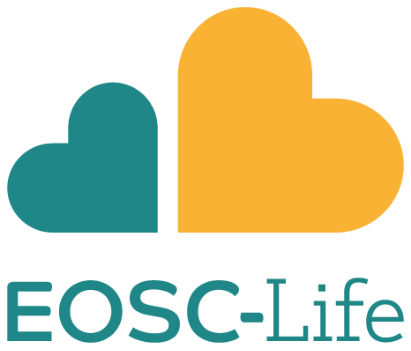

<!-- .slide: data-background="images/index.jpg" data-state="dim-background" -->
## Accessible and scalable detection and identification of foodborne pathogens

 

Bérénice Batut

<small>University of Freiburg, Germany   She/her - <i class="fab fa-twitter"></i> <i class="fab fa-github"></i> [@bebatut](twitter.com/bebatut) - <i class="fas fa-envelope"></i> berenice.batut@gmail.com</small>

 

<small>EOSC-Life 3rd AGM - March 2022</small>

<small style="position: absolute; right: 0%; font-size: 0.2em; bottom: -20%;">Photo by [Monstera](https://www.pexels.com/@gabby-k?utm_content=attributionCopyText&utm_medium=referral&utm_source=pexels) from [Pexels](https://www.pexels.com/photo/cutout-paper-composition-of-bacteria-on-green-background-5841807/?utm_content=attributionCopyText&utm_medium=referral&utm_source=pexels)</small>

Note:
- First of all, I would like to thank the organizers and the committee for giving me the opportunity to give the talk here

---
### Foodborne outbreak

"*An incident in which two or more people develop the same disease or infection following the consumption of a common contaminated food*"

 <!-- .element width="50%" -->

<small>[EFSA, 2021. Story map on foodborne outbreaks](https://multimedia.efsa.europa.eu/fbo-storymaps/index.html)</small>

Note:

A major burden on our society
(~ 600M people / year)

----
### Which causative agents?

 <!-- .element width="80%" -->

<small>[EFSA, 2019. Foodborne outbreaks - dashboard](https://www.efsa.europa.eu/en/microstrategy/FBO-dashboard)</small>

----
### Where food contamination may occur?

 <!-- .element width="80%" -->

<small>[EFSA, 2019. Foodborne outbreaks - dashboard](https://www.efsa.europa.eu/en/microstrategy/FBO-dashboard)</small>

----
### Investigation of a foodborne outbreak

Microbiological analysis of the probable responsible food at different point

**Goals**
- Detect the responsible pathogens
- Track the contamination source

 <!-- .element width="100%" -->

<small>Ronholm et al, 2016</small>

---
### Toward accessible and scalable detection and identification of foodborne pathogens

Funded by [EOSC-Life Digital Life Science Call for academia-industry collaborations](https://www.eosc-life.eu/industrycall/)

 <!-- .element width="80%" -->

---
### Invesigation of foodborne pathogen by Biolytix

 <!-- .element width="100%" -->

----
### Invesigation of foodborne pathogen by Biolytix

 <!-- .element width="100%" -->

---
### Migration to a modern and open paradigm

 <!-- .element width="100%" -->

---
### Expected value for the team

- Biolytix
    - Knowledge about leveraging bioinformatic pipelines to make them sustainable, cloud-native and scalable
    - Implementation of  better data and compute practices
- Freiburg Galaxy team
    - Concrete use case to develop and document the process of using Galaxy to modernize and FAIRify existing workflow
    - Resources to support the growing microbial and public health Galaxy communities
    - Data, workflows and training directly usable by the [Street Science community](https://streetscience.community/)
    - Deep insight in foodborne pathogen identification and tracking
    - Connections with existing projects like IRIDA

---
### Expected outcome for the community

**Accessible resources to detect foodborne pathogens via  direct food Nanopore sequencing**

1. No need for prior pathogen isolation
1. 1st **open** pipeline for food analysis using public open and **modern** infrastructures
    1. Open source and state-of-the-art tools
    2. Bioconda packages and BioContainers for dependencies
    3. **FAIR** and easily **adaptable** Galaxy workflows
        - Available via on [Galaxy Europe](https://usegalaxy.eu/)
        - Annotated and shared on WorkflowHub
        - Automatically tested using LifeMonitor
    4. **Documentation** in the form of online [GTN](https://training.galaxyproject.org/) tutorials
2. ~30TB of **public FAIR** data to **test** similar pipelines

Note:
Foodborne pathogens and their impact on human health are a major problem in the food industry. Advanced detection and tracing beyond classical methods would have a tremendous impact in  large and small scale food production. The identification of the exact pathogenic strains and their genomic information in the food without isolation would lead to a new level of food security. The source of food contaminants could be faster identified and avoid outbreaks of foodborne illnesses. Future outbreaks of foodborne pathogens with all its hassles could be reduced.

---
### Thank You!

 <!-- .element width="40%" -->

---
### Accessible and scalable detection and identification of foodborne pathogens

 <!-- .element width="80%" -->