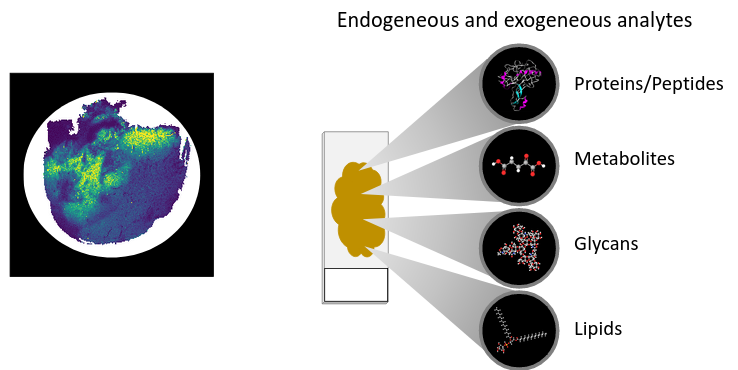
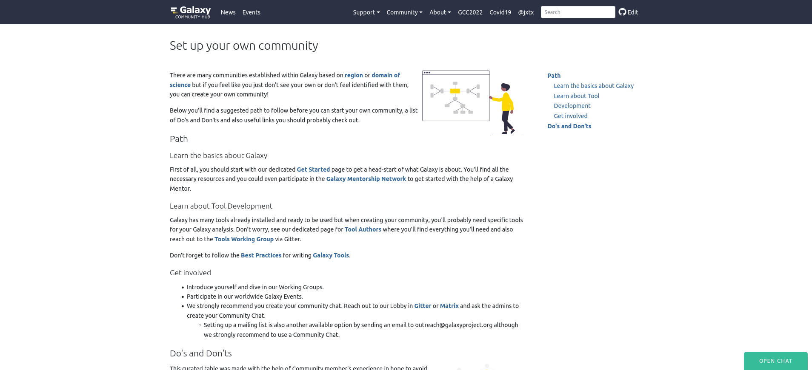

<!-- .slide: data-background-color="#dfcd71" -->

## Galaxy for your data analysis!

<!-- .element width="50%" -->

Bérénice Batut

<small>University of Freiburg, Germany   She/her - <i class="fab fa-twitter"></i> <i class="fab fa-github"></i> [@bebatut](twitter.com/bebatut) - <i class="fas fa-envelope"></i> berenice.batut@gmail.com</small>

<small>EMBL-EBI / Wellcome Trust Bioinformatics Summer School - June 2022</small>

Note:
- First of all, I would like to thank the organizers and the committee for giving me the opportunity to give the talk here

---
### Questions I would like to answer with this talk

- What is Galaxy?
- What are the general benefits of Galaxy?
- How Galaxy can help you with your data analyses?
- How can you use Galaxy?
- How is Galaxy used?
- How to start using Galaxy?
- How can you join the Galaxy community?

---
<!-- .slide: data-background-color="#dfcd71" -->

## What is Galaxy?

<!-- .element width="60%" -->

----
### Galaxy?

<!-- .element style="box-shadow: 5px 5px 5px grey !important;" -->

An **open-source** platform for **FAIR data analysis**

Note:
- Galaxy interface
- GUI for interactively running analysis tools on biomedical datasets
    - Tools
    - History
- Graphical interface for handling >1,000 samples
- Accessible via a Web browser

---
<!-- .slide: data-background-color="#dfcd71" -->

## What are the benefits of Galaxy?

<!-- .element width="60%" -->

----
### What are the benefits of Galaxy?

1. **Accessibility** — Empower scientists regardless of informatics expertise/access to infrastructure

Note:
- Accessibility
    - Data-intensive science requires use of large datasets, computational resources, and analysis methods
    - Human reference / annotation and example datasets are huge, but a Galaxy instance can host them as shared data for all users (no download/upload hassle, just ready to use in your analysis)

----
### Accessibility?

<!-- .element style="box-shadow: 5px 5px 5px grey !important;" -->

A **graphical web interface** for **running tools interactively**

Note:
- Interface

----
### Accessibility?

<!-- .element width="80%" style="box-shadow: 5px 5px 5px grey !important;" -->

A graphical web interface to a **powerful workflow system**

Note:
- Workflows

----
### Accessibility?

<!-- .element style="box-shadow: 5px 5px 5px grey !important;" -->

\>8,000 possible **command-line tools**

----
### Accessibility?

<!-- .element width="80%" style="box-shadow: 5px 5px 5px grey !important;" -->

**Interactive web tools** in Galaxy

Note:
- Tree, with trunc QC - Mapping, branch analysis and leaves Jupyter and interactive tools
- Interactive tools: R / Python
Makes interactive web tools available in Galaxy

Some examples:
Jupyter and RStudio for programmatic analyses
CellxGene for dynamic visualization

----
### Accessibility?

Many ways to get data into Galaxy

- Using **Upload Data**
    - Import from your computer
    - Create file by directly entering text
    - Import from a **URL**
    - Import from S3, DropBox, GoogleDrive
- Using **external public sources** e.g. UCSC, SRA
- From the **shared Galaxy Data Library**

----
### Accessibility?

- **Combining** datasets into **collections** to minimize clutter

<!-- .element width="20%" style="box-shadow: 5px 5px 5px grey !important;" -->

Note:
In Galaxy you perform data analyses and organize your data simply by clicking on things. If you have just a few items in your history, clicking is easy. However, in most real-world analyses you never have just a few datasets, instead you have many (sometimes thousands)
Not only may clicking on thousands datasets lead to a severe form of [carpal tunnel syndrome](https://en.wikipedia.org/wiki/Carpal_tunnel_syndrome), it may simply be impossible. **Collections** (also known as *Dataset collections* or *Lists*) described here help to resolve this situation and make very large analyses Galaxy-friendly.

A typical multi-dataset analysis of next-generation sequencing (NGS) data usually involves a large number of sequence datasets, such as, for example, fastq datasets generated by an Illumina machine or downloaded from a Short Read Archive. So it's usually a *collection* of similar things that need to be processed in a *collective* fashion.

A collection** is any number of datasets bundled as a **single** entity. In this example, to, say, map *N* fastq files against the human genome you need to manually start *N* mapping jobs. Yet if you first combine individual datasets into a collection, you will only need start a mapping job **once** using the collection as the only input.

----
### Accessibility?

- **Combining** datasets into **collections** to minimize clutter
- Reflecting **data complexity**

<!-- .element width="20%" style="box-shadow: 5px 5px 5px grey !important;" -->

Note:
The previous image shows how multiple fastq datasets can be combined in a single collection. But what if the sequencing data one wants to analyze is from a paired-end (or mate-pair) run where each individual sample is represented by *two* fastq files: forward and reverse? Galaxy collections can accommodate this structure:

Paired collection** preserves the relationship between read pairs and their respective samples

----
### Accessibility?

- **Combining** datasets into **collections** to minimize clutter
- Reflecting **data complexity**
- Building collections using **rules**

<!-- .element width="70%" style="box-shadow: 5px 5px 5px grey !important;" -->

----
### Accessibility?

- **Combining** datasets into **collections** to minimize clutter
- Reflecting **data complexity**
- Building collections using **rules**
- Processing many samples at once

<!-- .element width="70%" style="box-shadow: 5px 5px 5px grey !important;" -->

----
### Accessibility?

<!-- .element style="box-shadow: 5px 5px 5px grey !important;" width="80%" -->

- \>5 TB+ of **reference data**
- \>200 **genomes** and annotations
- **Databases** for >140 tools

Note:
- Shared data
- Reference data: ~ 50 GB of annotation data selectable from a dropdown menu

----
### What are the benefits of Galaxy?

1. **Accessibility** — Empower scientists regardless of informatics expertise/access to infrastructure

2. **Reproducibility** — Ensure that data-intensive analyses are high-quality

Note:

- Accessibility
    - Data-intensive science requires use of large datasets, computational resources, and analysis methods
    - Human reference / annotation and example datasets are huge, but a Galaxy instance can host them as shared data for all users (no download/upload hassle, just ready to use in your analysis)
- Reproducibility
    - Critical for advancing science, including peer review, validation, and extension
    - Bioinformatics methods are a rapidly moving field, but without reproducibility you cannot compare different approaches

----
### Reproducibility?

<!-- .element style="box-shadow: 5px 5px 5px grey !important;" -->

Detailed **metadata** about each step in an analysis

Note:
- Open source: software framework, tools, and utilities
- Worflows
- Detailed metadata about each steps in analysis, stored in Galaxy’s database

----
### Reproducibility?

<!-- .element style="box-shadow: 5px 5px 5px grey !important;" -->

Workflows!

Note:
- Worflows

----
### What are the benefits of Galaxy?

1. **Accessibility** — Empower scientists regardless of informatics expertise/access to infrastructure

2. **Reproducibility** — Ensure that data-intensive analyses are high-quality

3. **Sharing** — Clearly communicating what has been done

Note:
- Sharing
    - Multiple levels of information are needed from broad overview down to essential details and actual data

----
### Sharing?

<!-- .element style="box-shadow: 5px 5px 5px grey !important;" -->

**Any history**
- with **any user**
- via **link**
- published in the server's shared histories

----
### Sharing?

<!-- .element style="box-shadow: 5px 5px 5px grey !important;" -->

**Any workflow**
- with **any user**
- via **link**
- published in the server's shared workflows

----
### What are the benefits of Galaxy?

1. **Accessibility** — Empower scientists regardless of informatics expertise/access to infrastructure

2. **Reproducibility** — Ensure that data-intensive analyses are high-quality

3. **Sharing** — Clearly communicating what has been done

4. **Computational resources and tailored usage**

----
### Many ways to use Galaxy

<!-- .element width="80%" -->

Note:
1. Public servers such as usegalaxy.* instances, see https://galaxyproject.org/use/
2. Your laptop or local computer
3. Install locally with many compute environments
4. Deploy on a cloud

----
### usegalaxy.*: the big 3

<!-- .element width="80%" style="box-shadow: 5px 5px 5px grey !important;" -->

----
### What did you get in the big 3 usegalaxy.*?

- **Free** registration
- **Thousands** of documented and maintained **tools**
- **250 GB** per user
- Computational resources

----
### What are the benefits of Galaxy?

1. **Accessibility** — Empower scientists regardless of informatics expertise/access to infrastructure

2. **Reproducibility** — Ensure that data-intensive analyses are high-quality

3. **Sharing** — Clearly communicating what has been done

4. **Computational resources and tailored usage**

5. **Extensive learning resources**

----
### How can you learn to use Galaxy?

<!-- .element width="90%" style="box-shadow: 5px 5px 5px grey !important;" -->

[training.galaxyproject.org](https://training.galaxyproject.org)

----
### How can you learn to use Galaxy?

<!-- .element width="55%" -->

----
### How can you learn to use Galaxy?

<!-- .element width="90%" style="box-shadow: 5px 5px 5px grey !important;" -->

[training.galaxyproject.org](https://training.galaxyproject.org)

---
<!-- .slide: data-background-color="#dfcd71" -->

## How is Galaxy used?

<!-- .element width="60%" -->

----
### For which type of data analysis is Galaxy used?

Any data analysis!!!

- Transcriptomics
- Epigenetics
- Proteomics
- Metabolomics
- Drug Discovery
- Environment
- Climate Change

- Flow Cytometry
- Natural Language
- Cosmology
- Image Analysis
- Machine learning
- ...

Note:

In fact Galaxy is used in all sorts of domains, some of them having nothing to do with life sciences.

----
### Single-cell omics

<!-- .element width="100%" -->

[humancellatlas.usegalaxy.eu](https://humancellatlas.usegalaxy.eu)

<!-- .element width="24%" -->

[singlecell.usegalaxy.eu](https://singlecell.usegalaxy.eu)

----
### Galaxy single-cell training resources

----
### Somatic Variant Calling and Annotation for informing Molecular Tumor Boards

<!-- .element width="90%" -->

<!-- .element width="15%" style="box-shadow: 5px 5px 5px grey !important; border-radius: 50%;" -->

Note:
- MIRACUM = Medical Informatics for Research and Care in University Medicine
- Goal of the MIRACUM project based
    - foster IT innovations for healthcare research and medical care in Germany
- The project aims for accessibility and usability of clinical data, imaging data and data from molecular and genomics analyses at local and across different locations through a modular, scalable and federated data integration center.
- Taking advantage of digitalization in medicine, linking data and generating medical knowledge is required for a better, data-based healthcare delivery system. MIRACUM unites 10 university hospitals, 2 universities, and an industrial partner from 7 German federal states.
- As part of the MTB (Molecular Tumor Board) use case, the Freiburg Galaxy team: developing and maintaining together with Melanie Börries the EXOM-seq pipeline in Galaxy.

----
### Somatic Variant Calling and Annotation

A rich tool set to pick and build workflows from

- VarScan
- Strelka
- Mutect2
- Vardict
- Manta
- Delly
- VEP

- Control-FREEC
- Lumpy
- SnpEff
- SnpSift
- GEMINI
- vcfanno

Note:
- VarScan - variant detection
- Strelka - Small Variant Caller
- Mutect2 - somatic SNVs and indels caller
- Vardict - ultra sensitive variant caller
- Manta - structural variants (SVs) and indels caller
- Delly - integrated structural variant (SV) caller
- VEP - Ensembl Variant Effect Predictor
- Control-FREEC - detection of copy-number changes and allelic imbalances (including LOH)
- Lumpy - Probabilistic Framework for Structural Variant Discovery
- SnpEff - genomic variant annotations and functional effect prediction
- SnpSift - genomic variant annotations and functional effect prediction
- GEMINI - genome variation exploration
- vcfanno - genetic variant annotation

----
### MIRACUM workflow

<!-- .element width="90%" style="box-shadow: 5px 5px 5px grey !important;" -->

----
### MIRACUM workflow

<!-- .element width="100%" style="box-shadow: 5px 5px 5px grey !important;" -->

- adds all GEMINI-bundled annotations
    - cancerhotspots data
    - dbSNP annotations
    - CIViC information
    - CGI biomarkers data
- produces
    - tabular results lists in history for direct inspection
    - cBioportal-ready MAF
    - a clinician-friendly Workflow Report

Note:
- GEMINI
    - cancerhotspots data
        - statistically significant mutations in cancer
    - dbSNP annotations
        - public-domain archive for human single nucleotide variations, microsatellites, and small-scale insertions and deletions
    - CIViC information
        - Clinical Interpretation of Variants in Cancer
    - CGI biomarkers data
        - Cancer Genome Interpreter
- output
    - cBioportal-ready MAF
        - cBioportal for Cancer Genomics provides visualization, analysis and download of large-scale cancer genomics data sets
        - Mutation Annotation Format (MAF) -  tab-delimited text file with aggregated mutation information
    -

----
### Personal Cancer Genome Reporter (PCGR)

<!-- .element style="box-shadow: 5px 5px 5px grey !important;" -->

Note:
- Personal Cancer Genome Reporter (PCGR) - variant interpretation for precision cancer medicine

----
### Continuous analysis of intra-host variation in SARS-CoV-2

<!-- .element width="60%" style="box-shadow: 5px 5px 5px grey !important; border-radius: 50%;" -->

<!-- .element width="60%" style="box-shadow: 5px 5px 5px grey !important; border-radius: 50%;" -->

& many more!

<!-- .element width="60%" style="box-shadow: 5px 5px 5px grey !important; border-radius: 50%;" -->

[galaxyproject.org/projects/covid19](https://galaxyproject.org/projects/covid19/)

----
### Workflows for discovery of sequence variants

<!-- .element width="80%" -->

Note:
- Tutorials

----
### Continuous analyzis of a  subset of public read-level data

<!-- .element style="box-shadow: 5px 5px 5px grey !important;" -->

Note:
- Continuously analyze a subset of public read-level data
    - High quality metadata --> accurate variant calling by ensuring correct processing of variants contained within primer-annealing sites for datasets produced using ARTIC protocols
- Current set of samples produced by COG-UK, Estonian, Greek, Irish, and South African surveillance efforts
- Figure below shows the temporal distribution of analyzed samples.

----
### Intra-host variation

<!-- .element width="50%" style="box-shadow: 5px 5px 5px grey !important;" -->

Note:

Many lineage defining sites have been present in SARS-CoV-2 genomes at below-consensus frequencies well before becoming fixed. As we demonstrate on our recent virological post the mutations occurring at the 14 Omicron S-gene codons which display either evidence of negative selection or no evidence of selection (neutral evolution), have rarely been seen within previously sampled sequences (see here) indicating the action of strong purifying selection due to functional constraints. Despite the rarity of these mutations in assembled genomes, it is not uncommon to find them in within-patient sequence datasets (Figure below), often at sub-consensus allelic frequencies. This indicates that, with the possible exceptions of S/N764K, S/N856K and S/Q954H, the mutations at these sites are not rare simply because they are unlikely to occur, but rather because whenever they do occur they are unlikely to either increase sufficiently in frequency to be transmitted, or increase sufficiently in frequency among transmitting viruses to be detected by genomic surveillance.

----
### Mass Spectrometry Imaging
#### A histopathology use case

<!-- .element width="15%" style="box-shadow: 5px 5px 5px grey !important; border-radius: 50%;" -->

----
### MSI for molecular microscopy

Note:
- Distribution heatmaps of molecules from thin tissue sections can be generated by mass spectrometry imaging (MSI)
- Many endogeneous and exogeneous analytes can be measured:
- This typically covers proteins, peptides, metabolites and other small molecules, glycans and lipids.
- MALDI imaging does not require antibodies or labels and commonly operates in an untargeted approach.

----
### MSI data acquisition with a MALDI-TOF mass spectrometer

Note:
The tissue is mounted onto a glass slide and inserted into the mass spectrometer.
Different Mass spectrometer can be used for MSI.
MALDI-TOF is the most commonly used Mass spectrometer.
The tissue section is covered with a special chemical matrix, which enables ionization and evaporation of the analytes via MALDI. The ionized analytes travel through a tube and the time of flight (short TOF) is measured and from this the mass over charge, short m/z value can be calculated.
For each spot that is hit by the laser a full mass spectrum is generated with thousands of peaks is generated.
Typical spatial resolution are between 10 and 150µm, allowing (close to) cellular resolution.
Typically tens of thousands of spots are measured in a tissue section, generating the same amount of mass spectra. Each mass spectrum again contains tens of thousands of m/z – intensity pairs, thus often generating files of dozens of GB in size for a single sample.
The location of each mass spectrum on the tissue is known and therefore these heatmaps with the distribution profile of single analytes can be generated. Here is an example of a pig fetus and first an analyte located in the heart, the next one is located in the liver and the third mainly in the brain.

Afterward MSI the tissue can be stained with H&E and can be either compared with the generated MALDI images or segmentation map; or as an alternative approach histological annotations can be annotated in this optical image and then be transfered to the MSI data and used for supervised analysis of certain tissue regions.  The tissue is a pig fetus, first image = analyte in heart, second = analyte in liver, third = analyte in brain+spinal cord

----
### MSI data analysis tools in Galaxy

<small>[Föll et al., Gigascience, 2019](https://academic.oup.com/gigascience/article/8/12/giz143/5670614)</small>

Note:

(Overview of typical MSI data analysis steps and tools that are available in Galaxy for each step. )

We integrated the first set of tools for MS imaging data analysis in Galaxy
The tools cover all important MSI analysis steps which include QC, …
Thy use the open standard file imzML as input and output file

The Galaxy tools are based on open source tools that otherwise require programing knowledge in R or python.
The Galaxy GUI enabled also our medical students to fully conduct the analysis by themselves.

----
### Tryptic peptide imaging in  bladder cancer tissues

<!-- .element width="70%" -->

<small>[Föll et al., Clinical Proteomics, 2022](https://link.springer.com/article/10.1186/s12014-022-09347-z)</small>

Note:
39 bladder tissues with different urothelial cancer types
Imaging of digested proteins (tryptic peptides) with 150 µm spatial resolution
By using Galaxy this study is (probably) the first study of a clinical sample cohort that made data analysis fully transparent and reproducible.
According to the different analysis steps 7 Galaxy histories and workflows were used for the analysis – we published all of them.
Exemplary workflow showing preprocessing of the mass spectra to clean up the spectra before statistical analysis. The WF included our unique MSI quality control tool after each analysis step to tightly control the preprocessing.

----
### Microbiome

<!-- .element width="20%" -->

[metagenomics.usegalaxy.eu](https://microgalaxy.usegalaxy.eu/)

----
### 300+ tools for microbiome analysis

- **Microbial**: Scoary, Prokka, Roary
- **Metagenomics data manipulation**: VSearch, Nonpareil, DADA2
- **Metabarcoding**: Mothur, QIIME, Vegan, LotuS2
- **Assembly**: MEGAHIT, metaSPAdes, metaQUAST, Bandage
- **Binning**: MaxBin2, CONCOCT, MetaBAT
- **Taxonomy assignation**: MetaPhlAn, Kraken, CAT/BAT, MEGAN, Bracken
- **Metabolism assignation**: HUMAnN, PICRUST, InterProScan, MetaEuk, MetaGeneAnnotator
- **Visualization**: Export2graphlan, GraPhlAn, KRONA, Phinch
- **Metaproteomics**: MaxQuant, SearchGUI, PeptideShaker, Unipep
- ...

----
### ASaiM-MT

A validated and optimized workflow for metatranscriptomics

<!-- .element width="50%" -->

<small>[Mehta et al, F1000, 2021](https://f1000research.com/articles/10-103/v2)</small>

----
### (Meta-omics) Workflows in development

and others!

Note:
- Multi-omics
    - Here: metagenomics / metatranscriptomics
    - Other: metagenomics / metatranscriptomics / metaproteomics
- Foodborne pathogen detection
- Host decontamination
- SARS-CoV2 in wastewater

----
### Microbiome training material

<!-- .element width="70%" style="box-shadow: 5px 5px 5px grey !important;" -->

A lot of new tutorials in development!

<small>[training.galaxyproject.org/topics/metagenomics](training.galaxyproject.org/topics/metagenomics)</small>

Note:
- Big work on restructuration
- Development of new tutorials covering
    - Core steps: Data preparation, host decontamination, metagenome assembly, etc
    - Data interpretation: Diversity, Statistical analysis and visualization
    - Multi-omics integration
    - Use cases

----
### And many more applications for Galaxy!!

<!-- .element style="box-shadow: 5px 5px 5px grey !important;" -->

Check our [Galaxy Publication Library](https://www.zotero.org/groups/1732893/galaxy)

Note:

Check what others members have done in our Publication library which contains publications that use, reference, implement, and extend Galaxy.

---
<!-- .slide: data-background-color="#dfcd71" -->

## How to start?

<!-- .element width="70%" -->

----
### Step 1: Get acquainted with Galaxy terminology

<!-- .element style="box-shadow: 5px 5px 5px grey !important;" -->

<small>[galaxyproject.org/get-started/glossary/](https://galaxyproject.org/get-started/glossary/)</small>

----
### Step 2: Get familiar with Galaxy

#### Public Servers

<!-- .element width="90%" style="box-shadow: 5px 5px 5px grey !important;" -->

----
### Step 2: Get familiar with Galaxy

#### Training

<!-- .element width="90%" style="box-shadow: 5px 5px 5px grey !important;" -->

[training.galaxyproject.org](https://training.galaxyproject.org)

----
### Step 2: Get familiar with Galaxy

#### Galaxy Help & Bug Reports

- [FAQs](https://training.galaxyproject.org/training-material/faq)
- [Issues dedicated page for known issues, problems and tips](https://galaxyproject.org/issues/)
- Galaxy Help Forum: [help.galaxyproject.org/](https://help.galaxyproject.org/)

<!-- .element width="70%" style="box-shadow: 5px 5px 5px grey !important;" -->

Note:

Have a bug or an error you haven't been able to solve? Do you have a question that you haven't found already answered in the FAQs?

Check our issues dedicated page for known issues, problems and tips. Galaxy uses GitHub issues for tracking down bugs and feature requests, please make sure you search the list for duplicates before creating a new issue.

If you couldn't find a solution, reach out to the Galaxy Help Forum as the place to ask your questions related to Galaxy use or create an issue yourself. Either way, we are more than happy to help you out!

----
### Step 3: Find your place within the community

1. Regional Galaxy Communities

<!-- .element width="50%" style="box-shadow: 5px 5px 5px grey !important;" -->

[galaxyproject.org/community/](https://galaxyproject.org/community/)

----
### Step 3: Find your place within the community

1. Regional Galaxy Communities
2. Communities of practice

<!-- .element width="50%" style="box-shadow: 5px 5px 5px grey !important;" -->

[galaxyproject.org/community/](https://galaxyproject.org/community/)

----
### Step 3: Find your place within the community

1. Regional Galaxy Communities
2. Communities of practice
3. Set up your own community

<!-- .element width="70%" style="box-shadow: 5px 5px 5px grey !important;" -->

[galaxyproject.org/community/](https://galaxyproject.org/community/)

----
### Step 4: Take part and contribute to Galaxy

<!-- .element style="box-shadow: 5px 5px 5px grey !important;" -->

[galaxyproject.org/community/contributing/](https://galaxyproject.org/community/contributing/)

----
### Step 4: Take part and contribute to Galaxy

<!-- .element style="box-shadow: 5px 5px 5px grey !important;" -->

Galaxy Mentor Network: [galaxy-mentor-network.netlify.app](https://galaxy-mentor-network.netlify.app/)

---
## What is Galaxy?

<!-- .element width="60%" -->

Note:

- Different things to different communities
- Galaxy user communities
    - Scientists
    - Tool Developers
    - Educators
    - Service Providers

----
### What is Galaxy?

- **Graphical interface** for **interactive**ly running analysis tools on biomedical datasets, able to **handle >1,000 samples**
- Toolshed with **1,000s of tools** ready to run
- **Full featured workflow** functionality
- Integration of Jupyter, RStudio, and other **Interactive Tools for custom analyses**
- **Extensive training** tutorials and infrastructure
- TB of latest, curated **reference data**
- Created and supported by a **large international community** of scientists, developers, service providers, and educators

Note:

Galaxy is an interactive computational workbench for data-intensive science
- Designed to solve accessibility, reproducibility, and communication challenges
- Key features: Web UI, integrative framework, large world-wide community

Galaxy's unique aspects in my opinion:
- Web-based UI, but this is changing
- Integrative framework for putting things together—the whole is greater than the sum of the parts
- World-wide community

---
<!-- .slide: data-background="images/community.jpg" data-state="dim-background" -->

# Thank You  and the  Galaxy community!

<small style="position: absolute; right: 0%; font-size: 0.2em; bottom: -20%;">Photo by [Bérénice Batut on Flickr](https://flickr.com/photos/134305289@N03/48387086147/in/album-72157685584858176/)</small>

---
### What is Galaxy for you now?

<!-- .element width="40%" -->

- **Galaxy Community Hub** — [galaxyproject.org](https://galaxyproject.org)
- **Galaxy Training!** — [training.galaxyproject.org](https://training.galaxyproject.org/)
- **Galaxy Europe** — [usegalaxy.eu](https://usegalaxy.eu/)

